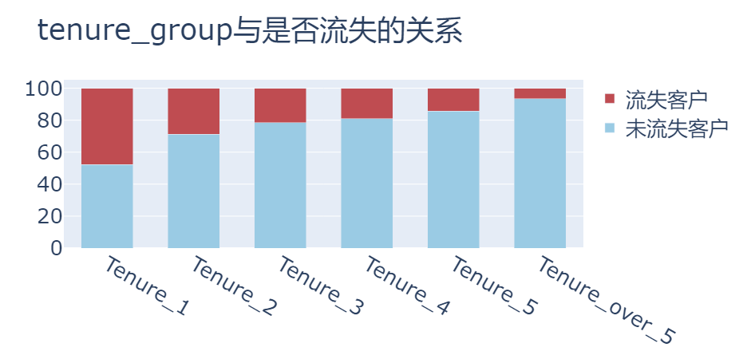
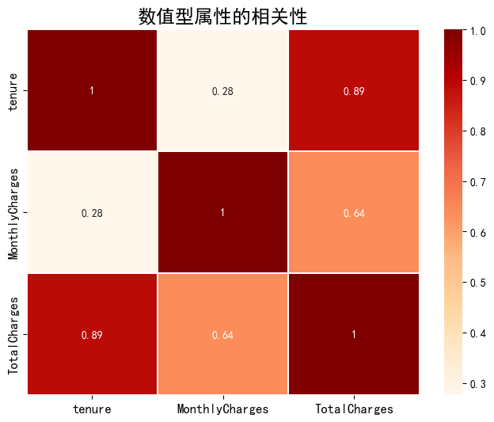
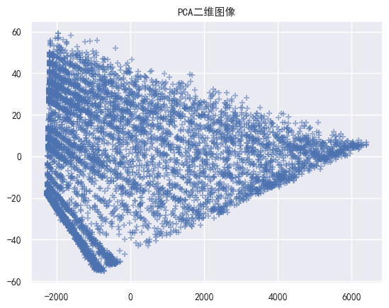

# 通信客户流失预警模型

## 挖掘过程

### 1. 业务理解

使用分类模型构建客户流失预测模型，通过客户为流失客户的概率预测该客户是否为流失客户并根据客户为流失客户的概率生成流失概率排序名单。  

### 2. 数据理解

在本案例中使用的数据来自于IBM Sample Data Sets，是某电信公司一段时间内的客户消费数据。共包含7043笔客户资料，每笔客户资料包含21个字段，其中1个客户ID字段，19个属性特征字段及1个标签字段（Yes代表流失，No代表未流失）。属性特征字段主要包含以下三个维度指标：客户画像指标（如性别、是否老年等）、消费产品指标（如是否开通互联网服务、是否开通电话服务等）、消费信息指标（如付款方式、月费用等）。字段的具体说明如表 1所示：  

字段|字段翻译|角色|特征类型|不同值个数|备注
:---|:---|:---|:---|:---|:---
customerID|客户ID|ID|无类型|7043|
Gender|性别|特征|类别|2|
SeniorCitizen|是否为老年人|特征|类别|2|初始取值为0/1，分别代表否/是
Partener|是否有配偶|特征|类别|2|
Dependents|是否和需抚养/赡养人同居|特征|类别|2|
Tenure|在网时长|特征|数值|单位：月|
PhoneService|是否开通电话服务业务|特征|类别|2|
MultipleLines|是否开通多线业务|特征|类别|3|取值为是/否/未开通电话业务
InternetService|是否开通互联网服务|特征|类别|3|取值为否/DSL/光纤
OnlineSecurity|是否开通网络安全服务|特征|类别|3|取值为是/否/未开通互联网服务
OnlineBackup|是否开通在线备份业务|特征|类别|3|取值为是/否/未开通互联网服务
DeviceProtection|是否开通了设备保护业务|特征|类别|3|取值为是/否/未开通互联网服务
TechSupport|是否开通了技术支持服务|特征|类别|3|取值为是/否/未开通互联网服务
StreamingTV|是否开通网络电视|特征|类别|3|取值为是/否/未开通互联网服务
StreamingMovies|是否开通网络电影|特征|类别|3|取值为是/否/未开通互联网服务
Contract|签订合同方式|特征|类别|3|
PaperlessBillling|是否开通电子账单|特征|类别|2|
PaymentMethod|付款方式|特征|类别|4|
MonthlyCharges|月费用|特征|数值||单位：美元
TotalCharges|总费用|特征|数值||单位：美元
Churn|是否流失|标签类别|类别|2|取值为是/否

### 3. 数据准备

1. 读入数据集

    ```py
    import numpy as np
    import pandas as pd

    # 读入数据集

    df = pd.read_csv('./Telco-Customer-Churn.csv')

    df.head()
    ```

2. 数据初步清洗  
   首先进行初步的数据清洗工作，包含错误值和异常值处理，并识别字段类型。  
   * 查看数据缺失值：

   ```py
   df.isnull().sum()
   # 发现没有缺失值
   df['TotalCharges'].value_counts()
   # 发现TotalCharges有11个' '空值，视为缺失值
   ```

   * 对MultipleLines、OnlineSecurity、OnlineBackup、DeviceProtection、TechSupport、StreamingTV、StreamingMovies进行处理，统一替换为yes/no  

   ```py
   repl_columns = [ 'OnlineSecurity', 'OnlineBackup', 'DeviceProtection','TechSupport', 'StreamingTV', 'StreamingMovies']
    for i in repl_columns:
        df[i] = df[i].replace({ 'No internet service': 'No'})
    df['MultipleLines'] = df['MultipleLines'].replace({'No phone service': 'No'})

    df["SeniorCitizen"] = df["SeniorCitizen"].replace({1: "Yes", 0: "No"}) 
   ```

   * 将TotalCharges中空格替换为空值并且删除，对tenure进行哑变量转换

   ```py
    # 替换值TotalCharges
    df['TotalCharges'] = df['TotalCharges'].replace(' ', np.nan)
    # TotalCharges空值：数据量小，直接删除
    df = df.dropna(subset=['TotalCharges'])
    df.reset_index(drop=True, inplace=True) # 重置索引
    # 转换数据类型
    df['TotalCharges'] = df['TotalCharges'].astype('float')

    # 转换tenure
    def transform_tenure(x):
        if x <= 12:
            return('Tenure_1')
        elif x <= 24:
            return('Tenure_2')
        elif x <= 36:
            return('Tenure_3')
        elif x <= 48:
            return('Tenure_4')
        elif x <= 60:
            return('Tenure_5')
        else:
            return('Tenure_over_5')
    df['tenure_group'] = df.tenure.apply(transform_tenure)
   ```

   * 提取数值型和类别型数据列

   ```py
    # 数值型和类别型字段
    Id_col = ['customerID']

    target_col = ['Churn']

    cat_cols = df.nunique()[df.nunique() < 10].index.tolist()

    num_cols = [i for i in df.columns if i not in cat_cols + Id_col]
   ```

3. 数据探索性分析
   * 绘制目标变量Churn分布饼状图
    ```py
    #目标变量Churn分布
    df['Churn'].value_counts()

    trace0 = go.Pie(labels=['未流失客户','流失客户'],
    #                 labels=df['Churn'].value_counts().index, 
                    values=df['Churn'].value_counts().values,
                    hole=.5,
                    rotation=90,
                    marker=dict(colors=['rgb(154,203,228)', 'rgb(191,76,81)'], 
                                line=dict(color='white', width=1.3))
                )
    data = [trace0] 
    layout = go.Layout(title='目标变量Churn分布', font=dict(size=26))

    fig = go.Figure(data=data, layout=layout)
    # py.offline.plot(fig, filename= '整体流失情况分布.html', auto_open=False)
    py.offline.iplot(fig)
    ```

      

    可以看到目标变量分布不平衡，正例反例约为3:7，是典型的类别不平衡问题。  
    * 然后绘制gender, SeniorCitizen, Dependents, tenure, tenure_group与Churn的关系  
    
    ```py
    def plot_bar(input_col: str, target_col: str, title_name: str):
        cross_table = round(pd.crosstab(df[input_col], df[target_col], normalize='index')*100, 2)

        # 索引
        index_0 = cross_table.columns.tolist()[0] 
        index_1 = cross_table.columns.tolist()[1] 

        # 绘图轨迹
        trace0 = go.Bar(x=cross_table.index.tolist(), 
                        y=cross_table[index_0].values.tolist(), 
                        name=index_0,
                        marker=dict(color='rgb(154,203,228)'),
                        name='未流失客户'
                    ) 
        trace1 = go.Bar(x=cross_table.index.tolist(), 
                        y=cross_table[index_1].values.tolist(), 
                        name=index_1,
                        marker=dict(color='rgb(191,76,81)'),
                        name='流失客户'
                    ) 

        data = [trace0, trace1] 
        # 布局
        layout = go.Layout(title=title_name, bargap=0.4, barmode='stack', font=dict(size=26))
        
        # 画布
        fig = go.Figure(data=data, layout=layout)
        # 绘图
        # py.offline.plot(fig, filename=f'./html/{title_name}.html',auto_open=False) 
        py.offline.iplot(fig)

    #性别与是否流失的关系
    chars = ['gender', 'SeniorCitizen', 'Dependents', 'tenure_group', 'tenure']
    for char in chars:
        plot_bar(input_col=char, target_col='Churn', title_name=char+'与是否流失的关系')
    ```

      
      
      
      
       

    对tenure属性进行分箱，减少了噪声的影响，可以看到分箱之后的数据有更明显的线性关系。

    * 绘制月费用与是否流失的关系
    ```py
    def plot_histogram(input_col: str, title_name: str):
        churn_num = df[df['Churn'] == 'Yes'][input_col]
        not_churn_num = df[df['Churn'] == 'No'][input_col] 
        
        # 图形轨迹
        trace0 = go.Histogram(x=churn_num, 
                            bingroup=25,
                            histnorm='percent',
                            name='流失客户',
                            marker=dict(color='rgb(191,76,81)')
                            )
        trace1 = go.Histogram(x=not_churn_num, 
                            bingroup=25,
                            histnorm='percent',
                            name='未流失客户',
                            marker=dict(color='rgb(154,203,228)')
                            )

        data = [trace0, trace1]
        layout = go.Layout(title=title_name, font=dict(size=26))

        fig = go.Figure(data=data, layout=layout)
        py.offline.iplot(fig) 
    plot_histogram(input_col='MonthlyCharges', title_name='月费用与是否流失的关系')
    ```

      

    发现月费用较高和较低的用户流失比例较少，处于中间的用户流失比例较高。  
    * 绘制数值型属性的相关性热力图

    ```py
    import matplotlib
    matplotlib.rc("font",family='SimHei')

    plt.figure(figsize=(8, 6))  
    sns.heatmap(df[num_cols].corr('spearman'), linewidths=0.1, cmap='OrRd', annot=True)
    plt.title('数值型属性的相关性', fontdict={'fontsize': 'xx-large', 'fontweight':'heavy'}) 
    plt.xticks(fontsize=12)
    plt.yticks(fontsize=12)
    plt.show() 
    ```

     

    可以看到与TotalCharges相关性较大。

4. 数据转换
   对于二分类变量，编码为0和1；对于多分类变量，进行one_hot编码；对于数值型变量，部分模型如KNN、神经网络、Logistic进行标准化处理。
   
   ```py
   from sklearn.preprocessing import LabelEncoder
    df_model = df
    Id_col = ['customerID']
    target_col = ['Churn']
    # 分类型
    cat_cols = df_model.nunique()[df_model.nunique() < 10].index.tolist()
    # 二分类属性
    binary_cols = df_model.nunique()[df_model.nunique() == 2].index.tolist()
    # 多分类属性
    multi_cols = [i for i in cat_cols if i not in binary_cols]
    # 数值型
    num_cols = [i for i in df_model.columns if i not in cat_cols + Id_col]
    # 二分类-标签编码
    le = LabelEncoder()
    for i in binary_cols:
        df_model[i] = le.fit_transform(df_model[i])
    # 多分类-哑变量转换
    df_model = pd.get_dummies(data=df_model, columns=multi_cols)
   ```

    再次查看热力图：  
     

    尝试使用PCA选择特征，发现前两个维度就能包含0.9999825的信息，绘制二维散点图：  
       

    可以发现确实有明显形状，但是不适合作为输入数据。  

    使用f_classif进行特征选择，即卡方检验，选择得分最高的前二十个属性。
    ```py
    from sklearn.feature_selection import SelectKBest
    from sklearn.feature_selection import f_classif

    X = df_model.copy().drop(['customerID','Churn'], axis=1)
    y = df_model[target_col]
    fs = SelectKBest(score_func=f_classif, k=20)
    X_train_fs = fs.fit_transform(X, y.to_numpy().ravel())
    X_train_fs.shape
    def SelectName(feature_data, model):
        # 选择出前20高分的列索引
        scores = model.scores_
        indices = np.argsort(scores)[::-1]
        return list(feature_data.columns.values[indices[0:model.k]])
    # 输出选择变量名称
    fea_name = [i for i in X.columns if i in SelectName(X,fs)]
    X_train = pd.DataFrame(X_train_fs,columns = fea_name)
    X_train.columns
    ```

    得到前二十的属性列'SeniorCitizen', 'Partner', 'Dependents', 'tenure', 'OnlineSecurity',
       'TechSupport', 'PaperlessBilling', 'MonthlyCharges', 'TotalCharges',
       'InternetService_DSL', 'InternetService_Fiber optic',
       'InternetService_No', 'Contract_Month-to-month', 'Contract_One year',
       'Contract_Two year', 'PaymentMethod_Bank transfer (automatic)',
       'PaymentMethod_Credit card (automatic)',
       'PaymentMethod_Electronic check', 'tenure_group_Tenure_1',
       'tenure_group_Tenure_over_5'。

### 4. 模型建立与评估

1. 使用分层抽样划分测试集、训练集，对需要的模型进行数据规范化

   ```py
    from sklearn.model_selection import train_test_split
    from sklearn.preprocessing import StandardScaler
    X_train, X_test, y_train, y_test = train_test_split(X_train, y, test_size=0.2, random_state=0, stratify=y)
    print(X_train.shape, X_test.shape, y_train.shape, y_test.shape)

    #修正索引
    for i in[X_train, X_test, y_train, y_test]:

        i.index = range(i.shape[0])

    # 保存标准化训练和测试数据
    st= StandardScaler()
    num_scaled_train= pd.DataFrame(st.fit_transform(X_train[num_cols]), columns=num_cols)
    num_scaled_test= pd.DataFrame(st.transform(X_test[num_cols]), columns=num_cols)
    X_train_scaled= pd.concat([X_train.drop(num_cols, axis= 1), num_scaled_train], axis= 1)
    X_test_scaled= pd.concat([X_test.drop(num_cols, axis= 1), num_scaled_test], axis= 1)
   ```

   得到训练集测试集大小分别为(5625, 20) (1407, 20) (5625, 1) (1407, 1)  

2. 使用`Logistic Regression`、`KNN Classifier`、`SVM Classifier Linear`、`SVM Classifier RBF`、`MLP Classifier`、`Naive Bayes`、`Decision Tree`、`Random Forest Classifier`、`LGBM Classifier`九个分类模型对数据进行分类预测，并计算得分。
   ```py
    # 建模
    from sklearn.linear_model import LogisticRegression
    from sklearn.neighbors import KNeighborsClassifier
    from sklearn.tree import DecisionTreeClassifier
    from sklearn import tree 
    from sklearn.ensemble import RandomForestClassifier
    from sklearn.naive_bayes import GaussianNB
    from sklearn.neural_network import MLPClassifier
    from sklearn.svm import SVC
    from lightgbm import LGBMClassifier

    # 模型评估
    from sklearn.model_selection import train_test_split, GridSearchCV
    from sklearn.metrics import confusion_matrix, accuracy_score, classification_report
    from sklearn.metrics import roc_auc_score, roc_curve
    from sklearn.metrics import recall_score, precision_score, f1_score, cohen_kappa_score

    def model_report(model, X_train, X_test, y_train, y_test, name):
        y_train = y_train.to_numpy().ravel()
        model.fit(X_train, y_train)
        y_pred  = model.predict(X_test)
        y_score = model.predict_proba(X_test)[:,1]
        
        # 评估指标
        accuracy = accuracy_score(y_test, y_pred)
        recallscore = recall_score(y_test, y_pred)
        precision = precision_score(y_test, y_pred)
        roc_auc = roc_auc_score(y_test, y_score)
        f1score = f1_score(y_test, y_pred) 
        kappa_metric = cohen_kappa_score(y_test, y_pred)
        
        # 保存数据
        df = pd.DataFrame({"Model"           : [name],
                        "Accuracy_score"  : [accuracy],
                        "Recall_score"    : [recallscore],
                        "Precision"       : [precision],
                        "f1_score"        : [f1score],
                        "Area_under_curve": [roc_auc],
                        "Kappa_metric"    : [kappa_metric],
                        })
        return df


    # 实例模型
    logit = LogisticRegression() 

    knn = KNeighborsClassifier(n_neighbors=5) 

    svc_lin  = SVC(kernel='linear', random_state=0, probability=True) 

    svc_rbf  = SVC(kernel='rbf', random_state=0, probability=True) 

    mlp_model = MLPClassifier(hidden_layer_sizes=(8,), alpha=0.05, max_iter=50000, 
                            activation='relu', random_state=0)

    gnb = GaussianNB()

    decision_tree = DecisionTreeClassifier(criterion='entropy', max_depth=5, random_state=0)  

    rfc = RandomForestClassifier(n_estimators=100, random_state=0) 

    lgbm_c = LGBMClassifier(boosting_type='gbdt', n_estimators=100, random_state=0) 

    model1 = model_report(logit, X_train_scaled, X_test_scaled, y_train, y_test,
                        "Logistic Regression")
    model2 = model_report(knn, X_train_scaled, X_test_scaled, y_train, y_test,
                        "KNN Classifier")
    model3 = model_report(svc_lin, X_train_scaled, X_test_scaled, y_train, y_test,
                        "SVM Classifier Linear")
    model4 = model_report(svc_rbf, X_train_scaled, X_test_scaled, y_train, y_test,
                        "SVM Classifier RBF")
    model5 = model_report(mlp_model, X_train_scaled, X_test_scaled, y_train, y_test,
                        "MLP Classifier")
    model6 = model_report(gnb, X_train, X_test, y_train, y_test,
                        "Naive Bayes")
    model7 = model_report(decision_tree, X_train, X_test, y_train, y_test,
                        "Decision Tree")
    model8 = model_report(rfc, X_train, X_test, y_train, y_test,
                        "Random Forest Classifier")
    model9 = model_report(lgbm_c, X_train, X_test, y_train, y_test,
                        "LGBM Classifier") 

    # 拼接表
    model_performances = pd.concat([model1, model2, model3,
                                    model4, model5, model6,
                                    model7, model8, model9
                                    ], axis=0).reset_index()

    model_performances = model_performances.drop(columns="index",axis =1)

    table  = ff.create_table(np.round(model_performances, 4))

    py.offline.iplot(table) 
   ```

   得分如下所示：  
      

3. 使用网格搜索调整决策树参数：
    ```py
    from sklearn.tree import DecisionTreeClassifier
    from sklearn.model_selection import  GridSearchCV
    from sklearn.metrics import confusion_matrix, accuracy_score, classification_report
    parameters = { 'splitter': ( 'best', 'random'),
                'criterion': ( "gini", "entropy"),
                "max_depth": [* range( 3, 20)],
    }

    clf = DecisionTreeClassifier(random_state= 25)

    GS = GridSearchCV(clf, parameters, scoring= 'f1', cv= 10)
    GS.fit(X_train, y_train)
    print(GS.best_params_)
    print(GS.best_score_)
    clf = GS.best_estimator_
    test_pred = clf.predict(X_test)
    print('测试集：\n', classification_report(y_test, test_pred))
    ```

    GS.best_params_={'criterion': 'entropy', 'max_depth': 5, 'splitter': 'best'}  
    GS.best_score_=0.6014522720158608  
    测试集：  
    report|precision|recall|f1-score|support
    :---|:---|:---|:---|:---
    0|0.84|0.88|0.86|1033
    1|0.62|0.53|0.57|374
    accuracy|||0.79|1407
    macro avg|0.73|0.71|0.71|1407
    weighted avg|0.78|0.79|0.78|1407

    得分较未进行网格搜索的决策树高。

    对该决策树进行可视化：
    ```py
    import graphviz
    part_DT = DecisionTreeClassifier(criterion='entropy', max_depth=3, random_state=0)
    part_DT.fit(X_train, y_train)

    dot_data = tree.export_graphviz(decision_tree=part_DT, max_depth=3,
                                    out_file=None, 
                                    feature_names=X_train.columns,
                                    class_names=['not_churn', 'churn'], 
                                    filled=True,
                                    rounded=True
                                    )
    graph = graphviz.Source(dot_data)
    graph
    ```

      

    输出决策树的属性重要性：

    ```py
    import plotly.figure_factory as ff
    import plotly as py

    imp = pd.DataFrame(zip(X_train.columns, clf.feature_importances_))
    imp.columns = ['feature', 'importances']
    imp = imp.sort_values('importances', ascending=False)
    imp = imp[imp['importances'] != 0]
    table = ff.create_table(np.round(imp, 4))
    py.offline.iplot(table)
    ```
      

4. 进行十折交叉验证，将数据集等比划分为十份，训练集:测试集=9:1，依次进行十次训练，取十次平均得分作为最终得分。  

   ```py
    # 进行十折交叉验证
    def train_10fold(model, X, y, name):
        # 评估指标
        accuracy = []
        recallscore = []
        precision = []
        roc_auc = []
        f1score = []
        kappa_metric = []

        # 初始化十折交叉验证对象
        kf = StratifiedKFold(n_splits=10, shuffle=True)
        with tqdm(10) as pbar:
            for train_index, val_index in kf.split(X, y):
                # 划分数据
                X_train, X_val = X.iloc[train_index], X.iloc[val_index]
                y_train, y_val = y.iloc[train_index], y.iloc[val_index]
                y_train = y_train.to_numpy().ravel()
                
                # 训练模型
                model.fit(X_train, y_train)
                y_pred  = model.predict(X_val)
                y_score = model.predict_proba(X_val)[:,1]
                
                # 记录评估指标
                accuracy.append(accuracy_score(y_val, y_pred))
                recallscore.append(recall_score(y_val, y_pred))
                precision.append(precision_score(y_val, y_pred))
                roc_auc.append(roc_auc_score(y_val, y_score))
                f1score.append(f1_score(y_val, y_pred) )
                kappa_metric.append(cohen_kappa_score(y_val, y_pred))
                pbar.update(1)
                pbar.set_description(name)

        # 保存数据
        df = pd.DataFrame({"Model"           : [name],
                           "Accuracy_score"  : [np.mean(accuracy)],
                           "Recall_score"    : [np.mean(recallscore)],
                           "Precision"       : [np.mean(precision)],
                           "f1_score"        : [np.mean(f1score)],
                           "Area_under_curve": [np.mean(roc_auc)],
                           "Kappa_metric"    : [np.mean(kappa_metric)],
                        })
        return df
   ```

   最终得分如下所示：  
     

5. 处理类别不平衡问题
   * 过采样与欠采样

    ```py
    from imblearn.over_sampling import RandomOverSampler
    from imblearn.under_sampling import RandomUnderSampler

    # 定义RandomOverSampler和RandomUnderSampler
    ros = RandomOverSampler(sampling_strategy='auto', random_state=42)
    rus = RandomUnderSampler(sampling_strategy='auto', random_state=42)

    # 进行过采样
    X_over_sampled, y_over_sampled = ros.fit_resample(X, y)

    # 进行欠采样
    X_under_sampled, y_under_sampled = rus.fit_resample(X, y)
    ```

    过采样得分：  
      

    欠采样得分：  
      

    可以看到过采样比欠采样效果好一些，而两者F1-score较之前有极大提升，尤其随机森林AUC值突破天际。
   * 调整训练权重
    由于原始训练集类别比例7:3，所以调整训练权重3:7，对可以修改权重的分类器重新训练：

    ```py
    # 设置权重
    weight={0: 3, 1: 7}

    # 选择可以设置权重的模型调整
    logit = LogisticRegression(class_weight=weight) 
    svc_lin  = SVC(kernel='linear', random_state=0, probability=True, class_weight=weight) 
    svc_rbf  = SVC(kernel='rbf', random_state=0, probability=True, class_weight=weight) 
    decision_tree = DecisionTreeClassifier(criterion='entropy', max_depth=5, random_state=0, class_weight=weight)  
    rfc = RandomForestClassifier(n_estimators=100, random_state=0, class_weight=weight) 
    lgbm_c = LGBMClassifier(boosting_type='gbdt', n_estimators=100, random_state=0, class_weight=weight) 
    model1 = model_report(logit, X_train_scaled, X_test_scaled, y_train, y_test, "Logistic Regression")
    model3 = model_report(svc_lin, X_train_scaled, X_test_scaled, y_train, y_test, "SVM Classifier Linear")
    model4 = model_report(svc_rbf, X_train_scaled, X_test_scaled, y_train, y_test, "SVM Classifier RBF")
    model7 = model_report(decision_tree, X_train, X_test, y_train, y_test, "Decision Tree")
    model8 = model_report(rfc, X_train, X_test, y_train, y_test, "Random Forest Classifier")
    model9 = model_report(lgbm_c, X_train, X_test, y_train, y_test, "LGBM Classifier") 
    model_performances = pd.concat([model1, model3,
                                    model4, 
                                    model7, model8, model9
                                    ], axis=0).reset_index()
    model_performances = model_performances.drop(columns="index",axis =1)
    table  = ff.create_table(np.round(model_performances, 4))
    py.offline.iplot(table) 
    ```

    得分如下：  
      

    可以看到虽然效果不如采样，但是F1-score仍有提升。

6. 绘制ROC曲线
   分别绘制不做调整训练、过采样、欠采样、调整权重四种情况下的ROC曲线：
     
     
     
     

   同得分一样，过采样的效果十分好，尤其随机森林分类器，已经接近理想分类器的效果。

## 实验小结

### 主要工作  

* 完成了除模型部署外的数据挖掘全流程，包括业务理解，数据理解，数据准备，模型构建与评估
* 在数据准备中完成了数据预处理的主要步骤，包括`数据清理`：删除缺失值，处理异常值等；`数据转换`：对标称数据进行哑变量转换，将二分类属性转换为0和1等；`数据集成`：将tenure进行分箱，创造新的属性组；`数据约减`：进行特征选择，使用PCA进行数据降维。
* 进行了探索性分析（EDA），绘制了部分属性与目标变量之间的关系，计算相关系数并绘制热力图。
* 构建并评估了模型，使用网格搜索优化决策树并可视化，计算模型混淆矩阵以及绘制ROC曲线，计算AUC值。

### 通信客户流失建议

通过比较各模型得分，可以发现超采样下的随机森林分类器取得了最好的效果，可以考虑使用该模型对用户类别进行预测，对潜在的流失客户推出更多举措以减少客户流失数量。  

依靠决策树强大的可解释性，根据模型训练得到的可视化结果，应该更多注意按月签订合同的客户，考虑在网时长以及网络服务类型，推出更有竞争力的服务。

### 创新点  

* 绘制了数据转换之后相关系数热力图
* 使用PCA对数据进行降维并且绘制了二维散点图，但是本数据集前两个维度甚至第一个维度就能够概括基本全部信息，并没有尝试仅使用两个维度训练模型
* 使用十折交叉验证方法训练数据集，最终得分与8:2拆分训练集测试集有所不同，可能是数据集大小不同，也可能是数据不独立导致
* 处理了类别不平衡问题，使用过采样、欠采样、调整训练权重三种方式训练模型，得到过采样的随机森林分类器效果很好