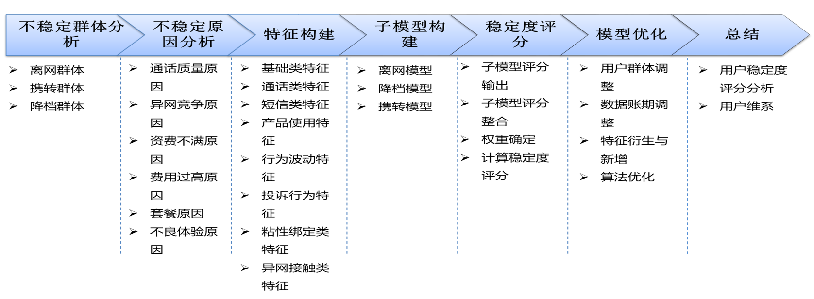
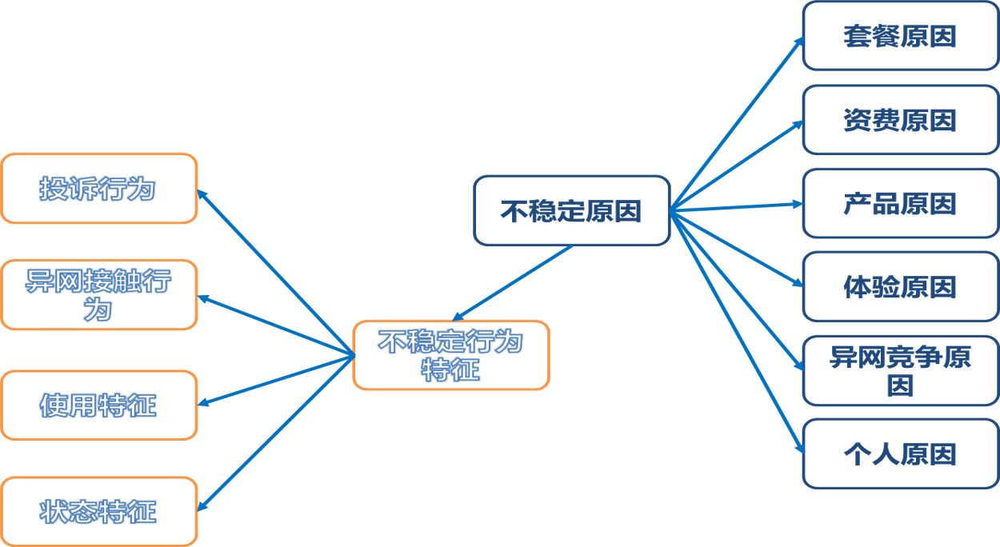
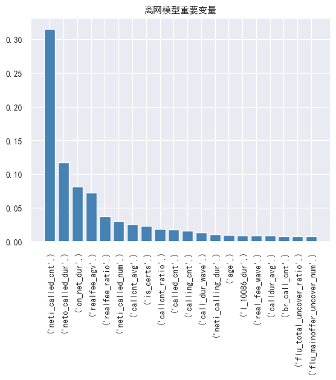
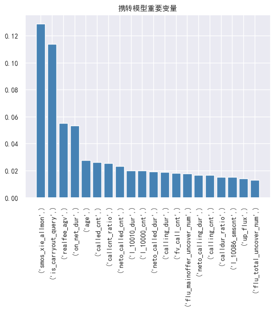
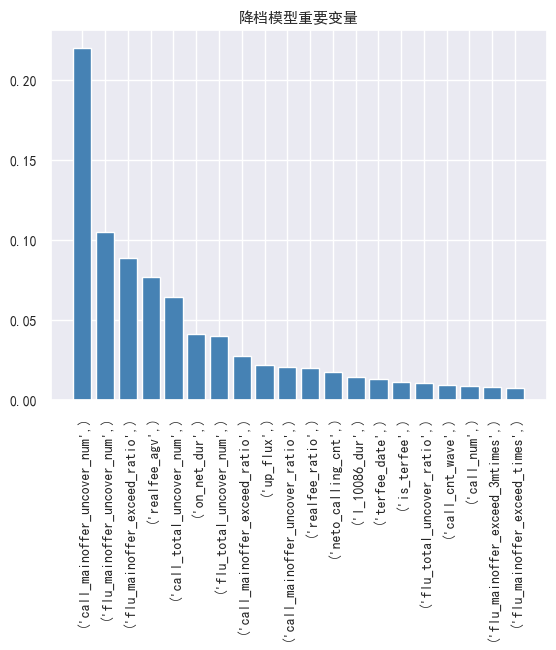
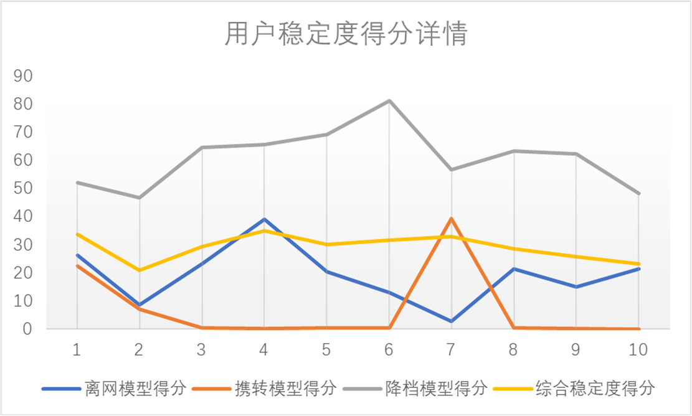

# 用户稳定度模型实验

## 业务理解

* 存量监管：缺少存量用户的有效监管和控制。全量用户缺少有层次、整体的客户评价得分。
* 模型现状：异动、预警类模型繁多。模型各自独立。覆盖用户群体重复。
* 应用现状：目标用户群体类别过多、整体输出量级过大。用户群相互关系空白，无效交集过多。看管效果重叠、成果难以控制。
* 投资收益：投资成本大大降低，存储、设备、技术、人才的成本都大大降低，对单位数据价值较低的数据也值得投资分析。

### 模型目标

* 建立离网、携转、降档等预警模型，输出各低稳定用户类型得分。
* 有效整合上述异动预警模型，输出全量用户稳定度综合评分。
* 结合客户低稳定度原因和营销相关的指标，对客户进行细分。

### 模型简介



## 数据理解

结合业务经验确定不稳定因素和不稳定客户群体。典型不稳定客户群为：离网客户、携转客户、降档客户。

### 不稳定原因



## 数据准备
118个原始特征

* 用户信息：用户年龄、性别、网龄、类型等
* 用户账单信息：月优惠额、实付额、缴费信息、欠费信息等
* 用户话单：通话次数、时长、通信圈、流量使用等
* 投诉工单：用户投诉类别、投诉次数、满意度等
* 用户合约信息：合约类型、合约期限

### 读入数据集

区分出数据集中的数值类型、标称类型。  
记录所有类型以及所要使用的数据列。方便后续训练过程。

```py
##数据读入  

import numpy as np
import pandas as pd
from sklearn.ensemble import GradientBoostingClassifier
from sklearn.metrics import classification_report
from sklearn.model_selection import train_test_split
# from sklearn.metrics import classification
from sklearn.metrics import confusion_matrix
import matplotlib.pyplot as plt
import seaborn as sns

#写入数据列名称   设置字段类型      
col_file = pd.read_csv("colname.csv", sep=',', header=None, index_col=None) #118个特征
allcol_list=[]
numcol_list=[]
catcol_list=[]
usecol_list=[]

model_col = []

for i in range(len(col_file)):
    allcol_list.append(col_file[0][i])
    if col_file[1][i]!='none' and col_file[1][i]!='flag': #num cat
        usecol_list.append(col_file[0][i])
    if col_file[1][i]=='num':
        numcol_list.append(col_file[0][i])
    if col_file[1][i]=='cat':
        catcol_list.append(col_file[0][i])
        
#读取数据  
alldata = pd.read_csv("train_test", sep=',', names=allcol_list ,index_col=None)
s=alldata.copy()
alldata.describe()
print('数据读取完成')
```

### 进行基本的数据清洗

填充缺失值，对标称属性进行编码。

```py
#字段类型设置   

#缺失值用零填充 
alldata = alldata.replace({'\\N': np.nan})
alldata = alldata.fillna(value=0)

#cat编码序列化 
for i in catcol_list:
    alldata[i] = alldata[i].astype('category')
    alldata[i] = alldata[i].cat.codes
```

## 模型构建

本实验构建三个子模型：

* 子模型一-离网模型：以离网用户为正样本、正常用户为负样本进行二分类模型训练。经过模型训练和调优，确定影响离网用户的主要特征，输出离网倾向用户和离网倾向得分。
* 子模型二-携转模型：以携转用户为正样本、正常用户为负样本进行二分类模型训练。经过模型训练和调优，确定影响携转用户的主要特征，输出携转倾向用户和携转倾向得分。
* 子模型三-降档模型：以降档用户为正样本、正常用户为负样本进行二分类模型训练。经过模型训练和调优，确定影响降档用户的主要特征，输出降档倾向用户和降档倾向得分。

### 绘制模型重要性前二十的属性

```py
def draw_features(model, title=''):
    feature_importance_array = model.feature_importances_
    df=pd.DataFrame(feature_importance_array,index=[usecol_list])
    df_dis=df.sort_values(by=0,ascending=False).head(20)

    rc = {'font.sans-serif': 'SimHei',
        'axes.unicode_minus': False}
    sns.set(font_scale=0.9,rc=rc)

    plt.bar(x = range(len(df_dis)), # 指定条形图x轴的刻度值
            height = df_dis[0], # 指定条形图y轴的数值
            tick_label = df_dis.index, # 指定条形图x轴的刻度标签
            color = 'steelblue', # 指定条形图的填充色
            width = 0.8, 
            )
    plt.title(title + '重要变量')
    plt.xticks(rotation=90)
    plt.show()
```

### 训练模型

根据类型选择flag属性中对应值，使用梯度提升模型对数据进行分类预测，并保存模型。

* 1离网模型 2携转模型 3降档模型
* 上述三种模型flag取值分别为1, 2, 3以及正常0
* 选择离网和正常作为正例和负例，其余同理

```py
import pickle

def train_model(model_num=1):
    model_name = ['', '离网模型', '携转模型', '降档模型']
    X=alldata[(alldata['flag']==0)|(alldata['flag']==model_num)][usecol_list]
    Y=alldata[(alldata['flag']==0)|(alldata['flag']==model_num)]['flag']
    #切分训练集
    X_train, X_test, y_train, y_test = train_test_split(X, Y, test_size=0.2, random_state=7)
    #模型训练gbdt
    model = GradientBoostingClassifier(learning_rate=0.4, 
                                       n_estimators=50, 
                                       subsample=0.75,
                                       max_depth=3, 
                                       max_features='log2',
                                       random_state=49
                                       )
    model.fit(X_train, y_train)

    ###保存模型到文件       

    with open('model/model_' + str(model_num) + '.pkl', 'wb') as file:
        pickle.dump(model, file)
        
        ##预测
    y_predict = model.predict(X_test)

    ##模型训练结果  分析   
    print(classification_report(y_test, y_predict))
    print(confusion_matrix(y_test, y_predict))
    draw_features(model, model_name[model_num])
```

分别设置model_num=1, 2, 3，得到三种模型训练效果以及模型重要性前二十属性。  

### 离网模型

| |precision|recall|f1-score|support
:--|:--|:--|:--|:--
0|0.90|0.94|0.92|1843
1|0.67|0.53|0.59|401
accuracy|||0.87|2244
macro avg|0.78|0.74|0.76|2244
weighted avg|0.86|0.87|0.86|2244

混淆矩阵：  
||1|0
:--:|:--:|:--:
1|1737  |106 
0|189 | 212



### 携转模型

| |precision|recall|f1-score|support
:--|:--|:--|:--|:--
0|0.95|0.98|0.96|1831
1|0.38|0.18|0.25|121
accuracy|||0.93|1952
macro avg|0.66|0.58|0.60|1952
weighted avg|0.91|0.93|0.92|1952

混淆矩阵：  
||1|0
:--:|:--:|:--:
1|1795  |36 
0|99 | 22



### 降档模型

| |precision|recall|f1-score|support
:--|:--|:--|:--|:--
0|0.78|0.75|0.77|1821
1|0.66|0.69|0.67|1255
accuracy|||0.73|3076
macro avg|0.72|0.72|0.72|3076
weighted avg|0.73|0.73|0.73|3075

混淆矩阵：  
||1|0
:--:|:--:|:--:
1|1370|451
0|389|866



### 使用模型

读取已训练模型，分别保存为model_1， model_2， model_3。  
读取预测数据，同样进行数据预处理。

```py
import numpy as np
import pandas as pd
import matplotlib.pyplot as plt
import pickle
import sys


#写入数据列名称   设置字段类型      
col_file = pd.read_csv("colname-pre.csv", sep=',', header=None, index_col=None)
allcol_list=[]
numcol_list=[]
catcol_list=[]
usecol_list=[]

for i in range(len(col_file)):
    allcol_list.append(col_file[0][i])
    if col_file[1][i]!='none' and col_file[1][i]!='flag':
        usecol_list.append(col_file[0][i])
    if col_file[1][i]=='num':
        numcol_list.append(col_file[0][i])
    if col_file[1][i]=='cat':
        catcol_list.append(col_file[0][i])
        
##模型读取  1离网模型  2携转模型  3降档模型 

with open('model//model_1.pkl', 'rb') as file:
    model_1 = pickle.load(file)

with open('model//model_2.pkl', 'rb') as file:
    model_2 = pickle.load(file)

with open('model//model_3.pkl', 'rb') as file:
    model_3 = pickle.load(file)

#读取数据 
all = pd.read_csv("pre_test", sep=',', names=allcol_list, header=None,index_col=False, chunksize=1000000)
for chunk in all:
    s=chunk.copy()
    alldata=chunk
#     alldata.describe()
#     print(chunk)
    print('数据读取完成')

###缺失值用零填充 
alldata = alldata.replace({'\\N': np.nan})
alldata = alldata.fillna(value=0)

 #cat编码序列化   
for i in catcol_list:
    alldata[i] = alldata[i].astype('category')
    alldata[i] = alldata[i].cat.codes
```

预测可能性，正常（稳定）为负例，因此预测结果为离网可能性。  
同时提取每个模型中重要性前五的列。

```py
##预测   输出三个子模型的得分   
X=alldata[usecol_list]

y_predict_proba_1 = pd.Series(model_1.predict_proba(alldata[usecol_list])[:,1].tolist(),index=alldata.index)

y_predict_proba_2 = pd.Series(model_2.predict_proba(alldata[usecol_list])[:,1].tolist(),index=alldata.index)

y_predict_proba_3 = pd.Series(model_3.predict_proba(alldata[usecol_list])[:,1].tolist(),index=alldata.index)

# 每个模型中重要性前五的列
imp_list_1 = ['realfee_agv','called_cnt','on_net_dur','call_cnt','neti_called_cnt']   
imp_list_2 = ['is_carryout_query','smos_xie_allmon','called_num','realfee_agv','neto_called_cnt']                
imp_list_3 = ['flu_mainoffer_uncover_times','call_mainoffer_uncover_num','realfee_agv','flu_total_uncover_num','call_total_uncover_times']       

s['realfee_agv']=s['realfee_agv']/100

result_data = pd.concat([s['subs_id'],y_predict_proba_1,s[imp_list_1],y_predict_proba_2,s[imp_list_2],y_predict_proba_3,s[imp_list_3]],axis=1)
result_data.rename(columns={0:'proba_1',1:'proba_2',2:'proba_3'},inplace=True)  
result_data.head()
```

计算加权稳定值得分，对降档权重

```py
###稳定度综合得分计算 
#1 降档模型分档字段设计
#2 汇总生成 稳定度综合得分   
# 分档位值处理       

s = s.replace({'\\N': np.nan})
s = s.fillna(value=0)
fav_list=s['fav_val'].copy().astype('float')

fav_list[(fav_list>=0  ) & (fav_list<=8 )]=1.0  
fav_list[(fav_list>8   ) & (fav_list<18 )]=0.280
fav_list[(fav_list>=18 ) & (fav_list<20 )]=0.555
fav_list[(fav_list>=20 ) & (fav_list<28 )]=0.588
fav_list[(fav_list>=28 ) & (fav_list<38 )]=0.687
fav_list[(fav_list>=38 ) & (fav_list<48 )]=0.650
fav_list[(fav_list>=48 ) & (fav_list<50 )]=0.528
fav_list[(fav_list>=50 ) & (fav_list<58 )]=0.569
fav_list[(fav_list>=58 ) & (fav_list<68 )]=0.651
fav_list[(fav_list>=68 ) & (fav_list<78 )]=0.356
fav_list[(fav_list>=78 ) & (fav_list<88 )]=0.472
fav_list[(fav_list>=88 ) & (fav_list<98 )]=0.399
fav_list[(fav_list>=98 ) & (fav_list<108)]=0.507
fav_list[(fav_list>=108) & (fav_list<118)]=0.386
fav_list[(fav_list>=118) & (fav_list<128)]=0.450
fav_list[(fav_list>=128) & (fav_list<138)]=0.498
fav_list[(fav_list>=138) & (fav_list<158)]=0.414
fav_list[(fav_list>=158) & (fav_list<168)]=0.480
fav_list[(fav_list>=168) & (fav_list<188)]=0.499
fav_list[(fav_list>=188) & (fav_list<198)]=0.511
fav_list[(fav_list>=198) & (fav_list<218)]=0.516
fav_list[(fav_list>=218) & (fav_list<238)]=0.451
fav_list[(fav_list>=238) & (fav_list<258)]=0.472
fav_list[(fav_list>=258) & (fav_list<268)]=0.330
fav_list[(fav_list>=268) & (fav_list<288)]=0.542
fav_list[(fav_list>=288) & (fav_list<298)]=0.575
fav_list[(fav_list>=298) & (fav_list<338)]=0.534
fav_list[(fav_list>=338) & (fav_list<388)]=0.568
fav_list[(fav_list>=388) & (fav_list<398)]=0.669
fav_list[(fav_list>=398) & (fav_list<588)]=0.686
fav_list[(fav_list>=588) & (fav_list<598)]=0.730
fav_list[ fav_list>=598                  ]=0.792
```

计算可能性加权平均值，除降档外权重均为1  

```py
#计算 降档分层系数
result_data['down_ratio']=fav_list
result_data['fav_val'] = s['fav_val'].astype('int')

# 计算加权平均值
result_data['stable_score_v3']=(result_data['proba_1']+result_data['proba_2']+result_data['proba_3']*result_data['down_ratio'])/(2+result_data['down_ratio'])

result_data
```

由于正常即保留为负例，因此可能性为离网可能性，此处转化为稳定性得分。

```py
result_data['proba_1']=(1-result_data['proba_1'])*100
result_data['proba_2']=(1-result_data['proba_2'])*100
result_data['proba_3']=(1-result_data['proba_3'])*100
result_data['stable_score_v3']=(1-result_data['stable_score_v3'])*100
result_data['statis_month']=s['statis_month']


print('结果生成完成')
result_data.round(3).to_csv("output//result_test", sep=',', header=True, index=False, encoding="UTF-8")

print('结果写入文件完成')

result_data.head()
```

最终测试用例得分如下图所示  


## 实验小结

本实验依照所给案例进行了复现，计算了加权稳定度得分。  
原案例中，以及所给数据集仅给出了十个测试用例，且映射后降档权重均为1，不能起到很好的验证效果。  
此外，原模型验证所给不稳定度比例柱状图中，x轴比例不均匀，最后一档为0-50得分，而第一档仅为100-95，不知道如此比较是否合适。