# 空气质量探索性分析报告

## 1. 业务背景

数据集是包含了北京 2013.12.02-2020.06.05 间每天的天气情况和空气质量等信息。  
空气质量数据通常用于监测和评估城市或地区的空气质量，以确保环境保护和公共健康。
政府和相关机构依赖于这些数据来制定相关政策和法规，以减少污染和改善空气质量。
此外，空气质量直接关系到市民的健康，因此数据的透明性和可理解性对市民至关重要。

## 2. 分析目的

通过数据可视化来显示数据之间的关联，从而对数据进行处理。

1. **异常检测：** EDA可以帮助识别空气质量数据中的异常值，这些异常可能是设备故障、异常天气或污染事件的结果。
2. **模式识别：** EDA有助于识别季节性、周期性和趋势性模式，以了解不同时间段的空气质量变化。
3. **数据完整性：** 可以检查数据的缺失情况，以确定数据的完整性并采取适当的措施来填充缺失值。
4. **数据可视化：** 数据可视化可以将复杂的数据转化为易于理解的图形，有助于传达信息。

## 3. 分析过程与结果

### 1. 数据集介绍

属性|含义
:---|:---
日期|记录相关日期
AQI| AQI(Air Quality Index)，空气质量指数，描述了空气清洁或者污染的程度，以及对健康的影响
质量等级|根据 AQI 将空气质量等级划分为六个等级
PM2.5|直径小于或等于 2.5μm 的尘埃或飘尘在环境空气中的浓度 数值单位：$μg/m^3$
PM10| 直径小于或等于 10.0μm 的尘埃或飘尘在环境空气中的浓度，数值单位：$μg/m^3$
SO2 |二氧化硫，大气的主要污染物之一，数值单位：$μg/m^3$
CO |一氧化碳，大气的主要污染物之一，数值单位：$mg/m^3$
NO2 |二氧化氮，大气的主要污染物之一，数值单位：$μg/m^3$
O3_8h| 臭氧的 8 小时滑动平均值，数值单位：$μg/m^3$
天气状况| 根据天气情况分为五种
气温 |指在野外空气流通、不受太阳直射下测得的空气温度（一般在百叶箱内测定）
风力风向 |风吹来的大小和方向

如下所示，导入所需库并加载数据集

``` python
import pandas as pd
import seaborn as sns
import matplotlib.pyplot as plt
# 以日期为索引
df = pd.read_csv('北京空气质量及天气情况缺失版.csv', index_col=0)
df.index = pd.to_datetime(df.index)
print(df)
```

<table border="1" class="dataframe">
  <thead>
    <tr style="text-align: right;">
      <th></th>
      <th>AQI</th>
      <th>质量等级</th>
      <th>PM2.5</th>
      <th>PM10</th>
      <th>SO2</th>
      <th>CO</th>
      <th>NO2</th>
      <th>O3_8h</th>
      <th>天气状况</th>
      <th>气温</th>
      <th>风力风向</th>
    </tr>
    <tr>
      <th>日期</th>
      <th></th>
      <th></th>
      <th></th>
      <th></th>
      <th></th>
      <th></th>
      <th></th>
      <th></th>
      <th></th>
      <th></th>
      <th></th>
    </tr>
  </thead>
  <tbody>
    <tr>
      <th>2013-12-02</th>
      <td>142</td>
      <td>轻度污染</td>
      <td>109</td>
      <td>138</td>
      <td>61</td>
      <td>2.6</td>
      <td>88</td>
      <td>11</td>
      <td>多云/多云</td>
      <td>11℃/-1℃</td>
      <td>无持续风向≤3级/无持续风向≤3级</td>
    </tr>
    <tr>
      <th>2013-12-03</th>
      <td>86</td>
      <td>良</td>
      <td>64</td>
      <td>86</td>
      <td>38</td>
      <td>1.6</td>
      <td>54</td>
      <td>45</td>
      <td>晴/晴</td>
      <td>14℃/-1℃</td>
      <td>无持续风向≤3级/无持续风向≤3级</td>
    </tr>
    <tr>
      <th>2013-12-04</th>
      <td>109</td>
      <td>轻度污染</td>
      <td>82</td>
      <td>101</td>
      <td>42</td>
      <td>2.0</td>
      <td>62</td>
      <td>23</td>
      <td>多云/多云</td>
      <td>12℃/0℃</td>
      <td>无持续风向≤3级/无持续风向≤3级</td>
    </tr>
    <tr>
      <th>2013-12-05</th>
      <td>56</td>
      <td>良</td>
      <td>39</td>
      <td>56</td>
      <td>30</td>
      <td>1.2</td>
      <td>38</td>
      <td>52</td>
      <td>晴/晴</td>
      <td>12℃/-3℃</td>
      <td>无持续风向≤3级/无持续风向≤3级</td>
    </tr>
    <tr>
      <th>2013-12-06</th>
      <td>169</td>
      <td>中度污染</td>
      <td>128</td>
      <td>162</td>
      <td>48</td>
      <td>2.5</td>
      <td>78</td>
      <td>15</td>
      <td>晴/霾</td>
      <td>11℃/-2℃</td>
      <td>无持续风向≤3级/无持续风向≤3级</td>
    </tr>
    <tr>
      <th>...</th>
      <td>...</td>
      <td>...</td>
      <td>...</td>
      <td>...</td>
      <td>...</td>
      <td>...</td>
      <td>...</td>
      <td>...</td>
      <td>...</td>
      <td>...</td>
      <td>...</td>
    </tr>
    <tr>
      <th>2020-06-01</th>
      <td>110</td>
      <td>轻度污染</td>
      <td>19</td>
      <td>56</td>
      <td>3</td>
      <td>0.4</td>
      <td>29</td>
      <td>170</td>
      <td>雷阵雨/多云</td>
      <td>30℃/16℃</td>
      <td>西南风4-5级/西南风4-5级</td>
    </tr>
    <tr>
      <th>2020-06-02</th>
      <td>99</td>
      <td>良</td>
      <td>23</td>
      <td>74</td>
      <td>2</td>
      <td>0.3</td>
      <td>25</td>
      <td>158</td>
      <td>晴/晴</td>
      <td>32℃/21℃</td>
      <td>南风3-4级/南风3-4级</td>
    </tr>
    <tr>
      <th>2020-06-03</th>
      <td>134</td>
      <td>轻度污染</td>
      <td>42</td>
      <td>218</td>
      <td>2</td>
      <td>0.3</td>
      <td>32</td>
      <td>141</td>
      <td>浮尘/晴</td>
      <td>34℃/19℃</td>
      <td>北风3-4级/北风3-4级</td>
    </tr>
    <tr>
      <th>2020-06-04</th>
      <td>68</td>
      <td>良</td>
      <td>8</td>
      <td>42</td>
      <td>3</td>
      <td>0.3</td>
      <td>20</td>
      <td>121</td>
      <td>多云/多云</td>
      <td>30℃/17℃</td>
      <td>东南风1-2级/东南风1-2级</td>
    </tr>
    <tr>
      <th>2020-06-05</th>
      <td>101</td>
      <td>轻度污染</td>
      <td>12</td>
      <td>38</td>
      <td>4</td>
      <td>0.5</td>
      <td>18</td>
      <td>161</td>
      <td>晴/晴</td>
      <td>30℃/17℃</td>
      <td>东南风1-2级/东南风1-2级</td>
    </tr>
  </tbody>
</table>
<p>2376 rows × 11 columns</p>

### 2. 查看缺失值

``` python
# 查看缺失值
k1 = df.isnull().sum()
k1.sort_values(ascending=False, inplace=True)
print(k1)
```

<pre>AQI      0
质量等级     0
PM2.5    0
PM10     0
SO2      0
CO       0
NO2      0
O3_8h    0
天气状况     0
气温       0
风力风向     0
dtype: int64</pre>

可以看到并没有缺失值，所有数据均完整。

### 3. 可视化分析

绘制AQI箱线图

``` py
rc = {'font.sans-serif': 'SimHei',
      'axes.unicode_minus': False}
sns.set(font_scale=0.9,rc=rc)

plt.title('AQI箱线图')
sns.boxplot(x=2013, y=df['2013':'2013']['AQI'])
sns.boxplot(x=2014, y=df['2014':'2014']['AQI'])
sns.boxplot(x=2015, y=df['2015':'2015']['AQI'])
sns.boxplot(x=2016, y=df['2016':'2016']['AQI'])
sns.boxplot(x=2017, y=df['2017':'2017']['AQI'])
sns.boxplot(x=2018, y=df['2018':'2018']['AQI'])
sns.boxplot(x=2019, y=df['2019':'2019']['AQI'])
sns.boxplot(x=2020, y=df['2020':'2020']['AQI'])
plt.show()
```

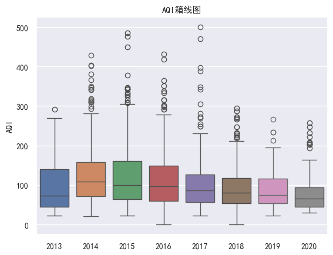  

可以发现平均AQI除2013-2014有所上升以外，其余年份均逐步下降。  
说明环境保护工作卓有成效，空气质量年年提升。  
由于极端天气，AQI指数极高的情况确实存在，因此无法判断箱线图中离群点是否为异常值。仅视为空气质量极差的天气。
可以看到，自2014年开始，空气质量极差的情况逐渐减少，到2018年以后，最高AQI不超过300.

``` py
# 空气质量等级分布图
plt.figure(figsize=(15, 6))
plt.subplot(241, title='2013空气质量')
plt.pie(df['2013':'2013']['质量等级'].value_counts(), labels=df['2013':'2013']['质量等级'].value_counts().index)
plt.subplot(242, title='2014空气质量')
plt.pie(df['2014':'2014']['质量等级'].value_counts(), labels=df['2014':'2014']['质量等级'].value_counts().index)
plt.subplot(243, title='2015空气质量')
plt.pie(df['2015':'2015']['质量等级'].value_counts(), labels=df['2015':'2015']['质量等级'].value_counts().index)
plt.subplot(244, title='2016空气质量')
plt.pie(df['2016':'2016']['质量等级'].value_counts(), labels=df['2016':'2016']['质量等级'].value_counts().index) 
plt.subplot(245, title='2017空气质量')
plt.pie(df['2017':'2017']['质量等级'].value_counts(), labels=df['2017':'2017']['质量等级'].value_counts().index)
plt.subplot(246, title='2018空气质量')
plt.pie(df['2018':'2018']['质量等级'].value_counts(), labels=df['2018':'2018']['质量等级'].value_counts().index) 
plt.subplot(247, title='2019空气质量')
plt.pie(df['2019':'2019']['质量等级'].value_counts(), labels=df['2019':'2019']['质量等级'].value_counts().index)
plt.subplot(248, title='2020空气质量')
plt.pie(df['2020':'2020']['质量等级'].value_counts(), labels=df['2020':'2020']['质量等级'].value_counts().index) 
plt.show()
```

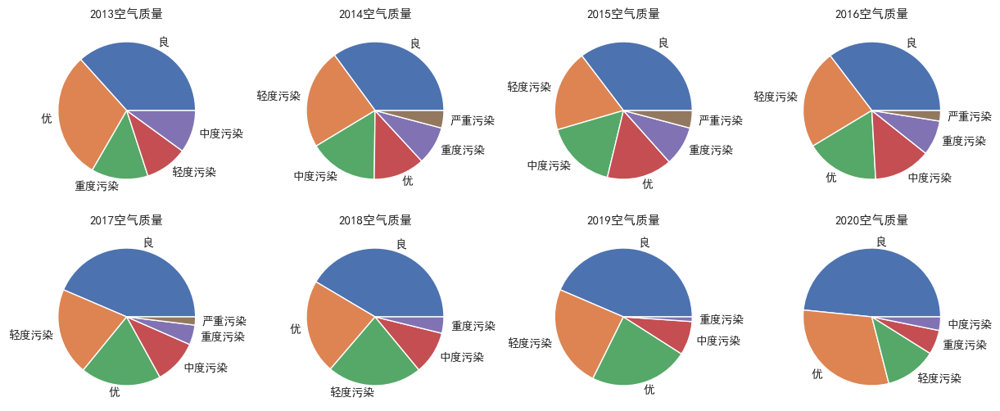   

同样的，污染天气所占比例逐年减少，2018年以后已不存在重度污染，空气质量优良占比超过$\frac{2}{3}$。

### 4. 数据处理

对气温数据做处理，将原本字符型的气温数据拆分成最高和最低气温，替换掉原本气温数据。并且计算平均气温。

```py
# 将气温拆分成最高气温和最低气温
df['最高气温'] = df['气温'].apply(lambda x :int(x.split('/')[0][0:-1]))
df['最低气温'] = df['气温'].apply(lambda x :int(x.split('/')[1][0:-1]))
df['平均气温'] = (df['最高气温'] + df['最低气温']) / 2
df.drop(columns=['气温'], inplace=True)
```

将空气质量等级数据量化

``` py
# 将空气质量等级量化
set(df['质量等级'].values)
{'严重污染', '中度污染', '优', '良', '轻度污染', '重度污染'}
```

可以发现共有六种类别，依次将其按照污染程度划分成1-5之间的数字

``` py
air_quality = {'严重污染': 5, '中度污染': 3, '优': 0, '良': 1, '轻度污染': 2, '重度污染': 4}
df['质量等级'] = df['质量等级'].map(air_quality)
```

将天气状况和风力风向量化，对每种类别随机分配一个数字。

``` py
weather = {elem:index for index,elem in enumerate(set(df['天气状况']))}
df['天气状况'] = df['天气状况'].map(weather)

wind = {elem:index for index,elem in enumerate(set(df['风力风向']))}
df['风力风向'] = df['风力风向'].map(wind)
```

得到量化之后的数据集：

<div>
<style scoped>
    .dataframe tbody tr th:only-of-type {
        vertical-align: middle;
    }
</style>
<table border="1" class="dataframe">
  <thead>
    <tr style="text-align: right;">
      <th></th>
      <th>AQI</th>
      <th>质量等级</th>
      <th>PM2.5</th>
      <th>PM10</th>
      <th>SO2</th>
      <th>CO</th>
      <th>NO2</th>
      <th>O3_8h</th>
      <th>天气状况</th>
      <th>风力风向</th>
      <th>最高气温</th>
      <th>最低气温</th>
      <th>平均气温</th>
    </tr>
    <tr>
      <th>日期</th>
      <th></th>
      <th></th>
      <th></th>
      <th></th>
      <th></th>
      <th></th>
      <th></th>
      <th></th>
      <th></th>
      <th></th>
      <th></th>
      <th></th>
      <th></th>
    </tr>
  </thead>
  <tbody>
    <tr>
      <th>2013-12-02</th>
      <td>142</td>
      <td>2</td>
      <td>109</td>
      <td>138</td>
      <td>61</td>
      <td>2.6</td>
      <td>88</td>
      <td>11</td>
      <td>1</td>
      <td>120</td>
      <td>11</td>
      <td>-1</td>
      <td>5.0</td>
    </tr>
    <tr>
      <th>2013-12-03</th>
      <td>86</td>
      <td>1</td>
      <td>64</td>
      <td>86</td>
      <td>38</td>
      <td>1.6</td>
      <td>54</td>
      <td>45</td>
      <td>0</td>
      <td>120</td>
      <td>14</td>
      <td>-1</td>
      <td>6.5</td>
    </tr>
    <tr>
      <th>2013-12-04</th>
      <td>109</td>
      <td>2</td>
      <td>82</td>
      <td>101</td>
      <td>42</td>
      <td>2.0</td>
      <td>62</td>
      <td>23</td>
      <td>1</td>
      <td>120</td>
      <td>12</td>
      <td>0</td>
      <td>6.0</td>
    </tr>
    <tr>
      <th>2013-12-05</th>
      <td>56</td>
      <td>1</td>
      <td>39</td>
      <td>56</td>
      <td>30</td>
      <td>1.2</td>
      <td>38</td>
      <td>52</td>
      <td>0</td>
      <td>120</td>
      <td>12</td>
      <td>-3</td>
      <td>4.5</td>
    </tr>
    <tr>
      <th>2013-12-06</th>
      <td>169</td>
      <td>3</td>
      <td>128</td>
      <td>162</td>
      <td>48</td>
      <td>2.5</td>
      <td>78</td>
      <td>15</td>
      <td>4</td>
      <td>120</td>
      <td>11</td>
      <td>-2</td>
      <td>4.5</td>
    </tr>
    <tr>
      <th>...</th>
      <td>...</td>
      <td>...</td>
      <td>...</td>
      <td>...</td>
      <td>...</td>
      <td>...</td>
      <td>...</td>
      <td>...</td>
      <td>...</td>
      <td>...</td>
      <td>...</td>
      <td>...</td>
      <td>...</td>
    </tr>
    <tr>
      <th>2020-06-01</th>
      <td>110</td>
      <td>2</td>
      <td>19</td>
      <td>56</td>
      <td>3</td>
      <td>0.4</td>
      <td>29</td>
      <td>170</td>
      <td>12</td>
      <td>28</td>
      <td>30</td>
      <td>16</td>
      <td>23.0</td>
    </tr>
    <tr>
      <th>2020-06-02</th>
      <td>99</td>
      <td>1</td>
      <td>23</td>
      <td>74</td>
      <td>2</td>
      <td>0.3</td>
      <td>25</td>
      <td>158</td>
      <td>0</td>
      <td>17</td>
      <td>32</td>
      <td>21</td>
      <td>26.5</td>
    </tr>
    <tr>
      <th>2020-06-03</th>
      <td>134</td>
      <td>2</td>
      <td>42</td>
      <td>218</td>
      <td>2</td>
      <td>0.3</td>
      <td>32</td>
      <td>141</td>
      <td>69</td>
      <td>132</td>
      <td>34</td>
      <td>19</td>
      <td>26.5</td>
    </tr>
    <tr>
      <th>2020-06-04</th>
      <td>68</td>
      <td>1</td>
      <td>8</td>
      <td>42</td>
      <td>3</td>
      <td>0.3</td>
      <td>20</td>
      <td>121</td>
      <td>1</td>
      <td>144</td>
      <td>30</td>
      <td>17</td>
      <td>23.5</td>
    </tr>
    <tr>
      <th>2020-06-05</th>
      <td>101</td>
      <td>2</td>
      <td>12</td>
      <td>38</td>
      <td>4</td>
      <td>0.5</td>
      <td>18</td>
      <td>161</td>
      <td>0</td>
      <td>144</td>
      <td>30</td>
      <td>17</td>
      <td>23.5</td>
    </tr>
  </tbody>
</table>
<p>2376 rows × 13 columns</p>
</div>

绘制各年份平均气温折线图

```py
def draw_line_by_year(column='AQI'):
    plt.figure(figsize=(15, 6))
    plt.subplot(241)
    sns.lineplot(data=df['2013':'2013'][column])
    plt.subplot(242)
    sns.lineplot(data=df['2014':'2014'][column])
    plt.subplot(243)
    sns.lineplot(data=df['2015':'2015'][column])
    plt.subplot(244)
    sns.lineplot(data=df['2016':'2016'][column])
    plt.subplot(245)
    sns.lineplot(data=df['2017':'2017'][column])
    plt.subplot(246)
    sns.lineplot(data=df['2018':'2018'][column])
    plt.subplot(247)
    sns.lineplot(data=df['2019':'2019'][column])
    plt.subplot(248)
    sns.lineplot(data=df['2020':'2020'][column])
    plt.show()

draw_line_by_year('平均气温')
```

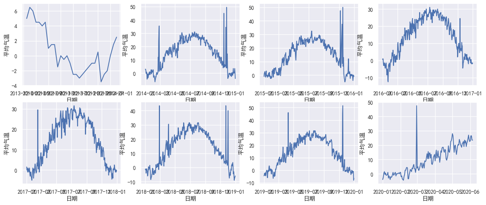  

可以发现有明显的异常值，平均气温高达50摄氏度。  
进一步绘制最高气温和最低气温折线图。

```py
# 可以发现平均气温有明显异常值
# 绘制最低和最高气温进一步查看
# 最高气温折线图
draw_line_by_year('最高气温')
# 最低气温折线图
draw_line_by_year('最低气温')
```

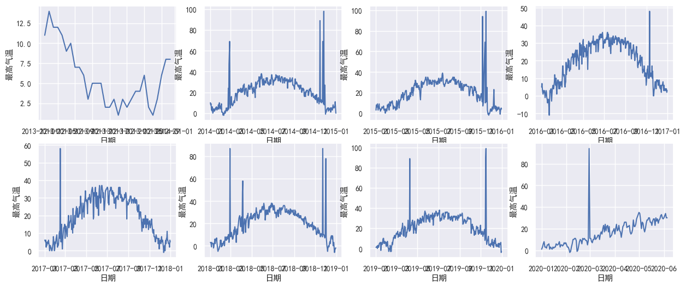  
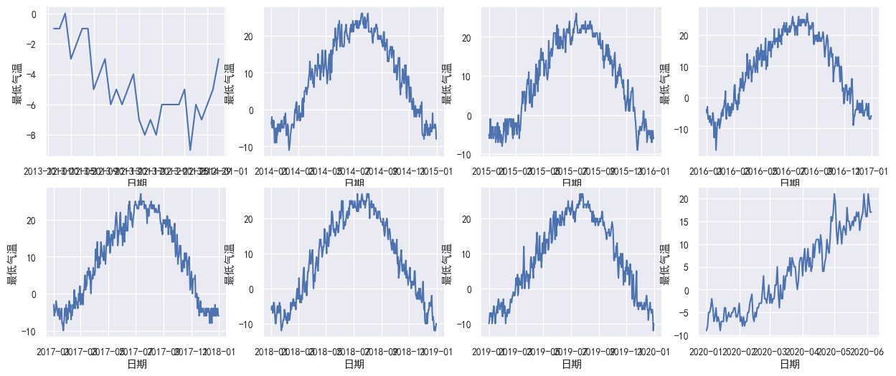  

发现最低气温正常，而最高气温有明显异常值。几乎每年的二月和十一月都有气温极高的异常出现。  
寻找比附近15天平均气温高的日期，定为异常值，绘制散点图查看

```py
# 绘图，可以发现最高气温有明显的的异常值，使用相邻日期气温替代

# window_size 是用于计算平均值的窗口大小
# 计算每个日期前后窗口大小内的平均值和中位数
rolling_average = df['最高气温'].rolling(window=15, min_periods=1, center=True).mean()
rolling_median = df['最高气温'].rolling(window=15, min_periods=1, center=True).median()

# 找出异常值的索引
outliers = (df['最高气温'] - rolling_average) > 15

# 查看异常值，其中最低温度为2015年冬天，最高气温25度左右显然异常
sns.scatterplot(data=df.loc[outliers, '最高气温'])
plt.show()
```

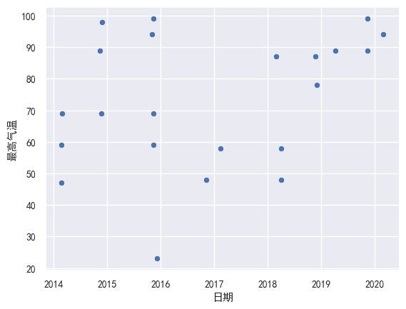  
发现其中最低温度为2015年冬天，最高气温25度左右显然异常，其余气温均超过40度，明显异常。  

将异常值替换为相邻日期的中位数, 再次查看最高气温折线图

```py
# 将异常值替换为相邻日期的中位数
df.loc[outliers, '最高气温'] = rolling_median[outliers].values
# 再次查看最高气温折线图
draw_line_by_year('最高气温')
```

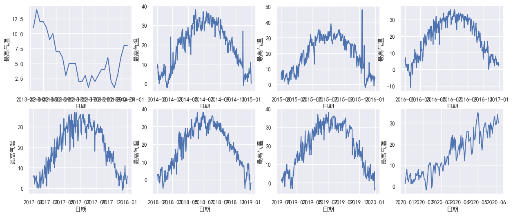  

发现处理结果不太理想，对于2014及2015部分日期仍然有明显异常值,推测是很长时间（超过所设置15天窗口）的异常气温导致平均值和中位数都偏高, 替换过后的气温仍然属于异常范围。  
改用温差检测异常值：

```py
df['温差'] = df['最高气温'] - df['最低气温']
draw_line_by_year('温差')
```

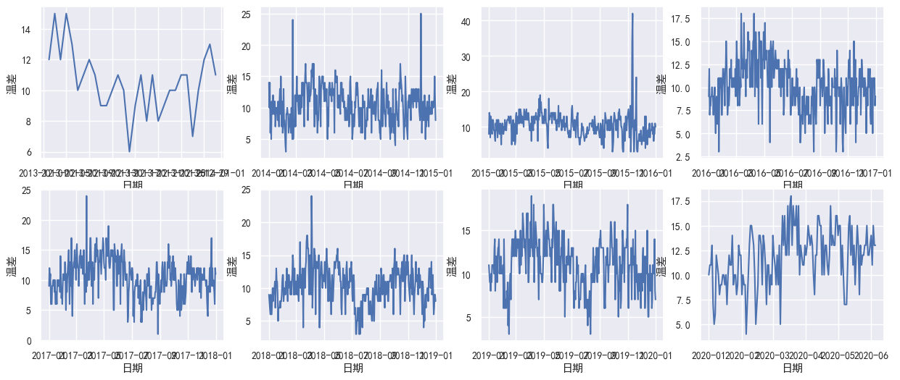  

可以看到，几乎全年的温差都在10度左右，超过20度的日期已经属于明显异常值。  
将温差大于20的日期替换为最低气温+10，再次查看最高气温。

```py

outliers = df['温差'] > 20
df.loc[outliers, '最高气温'] = df.loc[outliers, '最低气温'] + 10
draw_line_by_year('最高气温')
```

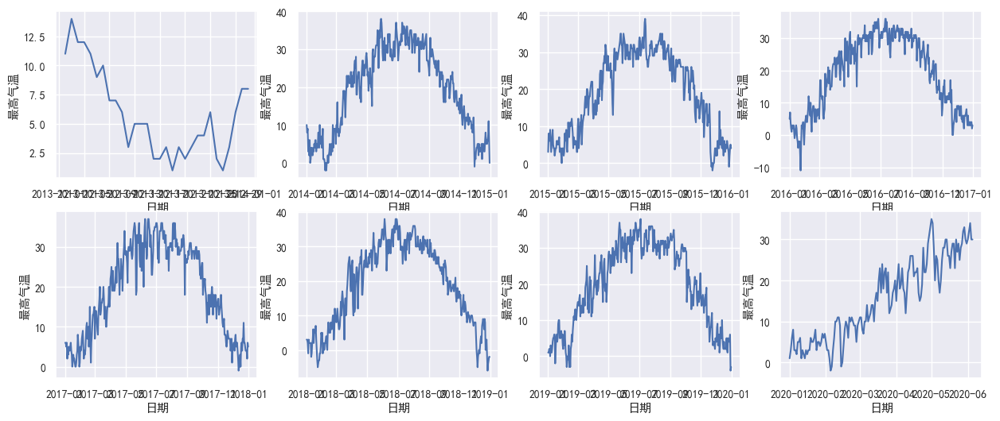  

可以发现气温已经基本正常。

### 5. 相关性分析

* 绘制斯皮尔曼相关系数热力图

``` py
  # AQI与其他数据的spearman相关系数
sprm = df.corr(method='spearman')
# print(stmk.sort_values(ascending=False))

plt.title('spearman相关系数热力图')
sns.heatmap(sprm,
            annot=True,  # 显示相关系数的数据
            center=0.5,  # 居中
            fmt='.2f',  # 只显示两位小数
            vmin=0, vmax=1,  # 设置数值最小值和最大值
            xticklabels=True, yticklabels=True,  # 显示x轴和y轴
            square=True,  # 每个方格都是正方形
            cbar=True,  # 绘制颜色条
            linewidths=.5,
            cmap="OrRd",        #刻度颜色
            annot_kws={"size": 10}
            )
plt.show()
```

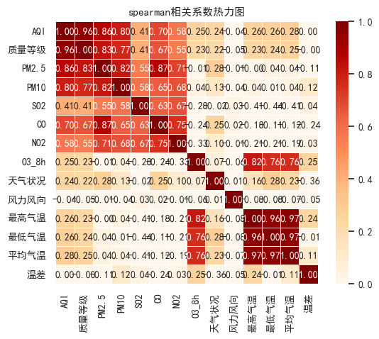  

* 绘制皮尔逊相关系数热力图  

```py
# AQI与其他数据的pearson相关系数
prs = df.corr(method='pearson')
# print(stmk.sort_values(ascending=False))

plt.title('pearson相关系数热力图')
sns.heatmap(prs,
            annot=True,  # 显示相关系数的数据
            center=0.5,  # 居中
            fmt='.2f',  # 只显示两位小数
            vmin=0, vmax=1,  # 设置数值最小值和最大值
            xticklabels=True, yticklabels=True,  # 显示x轴和y轴
            square=True,  # 每个方格都是正方形
            cbar=True,  # 绘制颜色条
            linewidths=.5,
            cmap="Blues",        #刻度颜色
            annot_kws={"size": 10}
            )
plt.show()
```

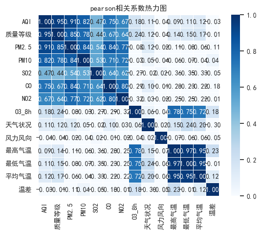  

观察两幅热力图，可以发现$(AQI, 质量等级, PM2.5, PM10, SO_2, CO, NO_2, O_38h)$，$(O_38h)$与$(最高气温, 最低气温, 平均气温)$之间相关系数较高。  
实际上平均气温原本就是最高气温, 最低气温,的平均值，而最高气温和最低气温本就有很强的关联性。  
而质量等级是根据AQI不同而划分等级得到的，而AQI又是通过$(PM2.5, PM10, SO_2, CO, NO_2, O_38h)$几个参数联合测定计算的。因此本该有极强的关联性。  
相关系数显示臭氧的 8 小时滑动平均值与气温有很强的关联性，值得进一步分析探索。

## 4. 结论
分析过去几年内空气质量各项参数，可以发现北京市空气质量有明显改善，AQI值明显降低，质量等级明显提升。  
虽然数据集是缺失版，但是实际发现并没有缺失值。AQI与空气中各种成分的浓度不好简单推断是否为异常值，需要进一步分析。而气温超过50摄氏度就可以确定为异常值，因此可以直观判断并且修正。  
通过计算相关系数，发现臭氧与气温有很强的关联性，值得进一步挖掘分析。  
此外天气状况与风力风向在数值化的过程中随机分配了数值。直观来看，天气状况为晴、风力较大的日期空气应当较好，而天气状况为雾霾、浮尘的天气应当空气较差。因此根据天气状况的好坏，风力的大小顺序数值化天气状况与风力风向或许可以得到更强的关联性。
